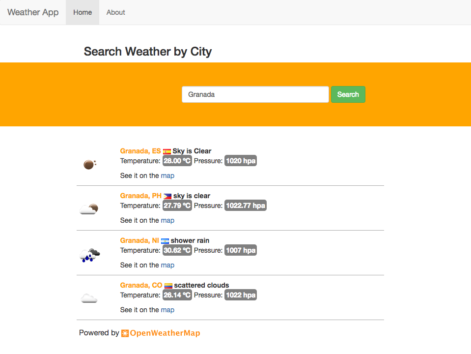

Weather App: An introduction to Angular development
=========

This app showcases the usage of some of the most common features found in an Angular web application:

* Components.
* Http Services (Powered by [OpenWeatherMap](http://openweathermap.org/)).
* Forms and input validation.
* Custom Pipes.
* Basic routing.
* CSS styling using BootStrap.

Additionally this project [branch](https://bitbucket.org/benitogr_code/angular-weatherapp/branch/deploy-1.0) demostrates AOT compilation and bundling for static deployment of the app.

To learn more about Angular:

* TypeScript: https://www.typescriptlang.org
* Angular: https://angular.io

Try it yourself
---------

Try the app at [http://bgr-ng-weatherapp.surge.sh](http://bgr-ng-weatherapp.surge.sh)

